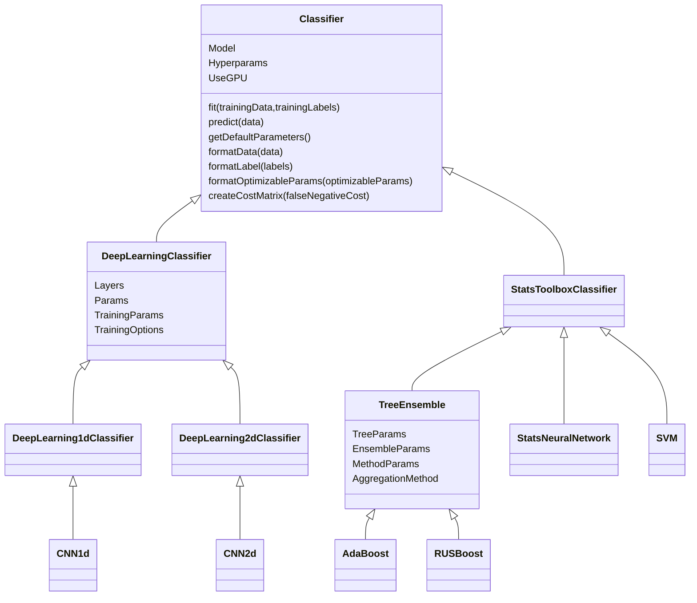

# Classifier classes

This folder contains classes that implement a unified interface for classifiers in the Statistic/Machine Learning Toolbox and the Deep Learning Toolbox.

## Method descriptions
| method                | description |
|-----------------------|-------------|
|`fit`                     | Train the classifier|
|`predict`                 | Predict the labels of new data|
|`getDefaultParameters`    | Get the classifier's default parameters|
|`formatData`              | Format the data in the format that the underlying classifier needs.|
|`formatLabels`            | Format the labels in the format that the underlying classifier needs.|
|`formatOptimizableParams` | Format bayesopt OptimizableVariables to be compatible with the classifier's constructor. |
|`createCostMatrix`        | Create the cost matrix in the format that the classifier needs.|

See the built-in help-text and html documentation using `help` and `doc`.

## Class diagram
The diagram below illustrates the class hiearchy.

